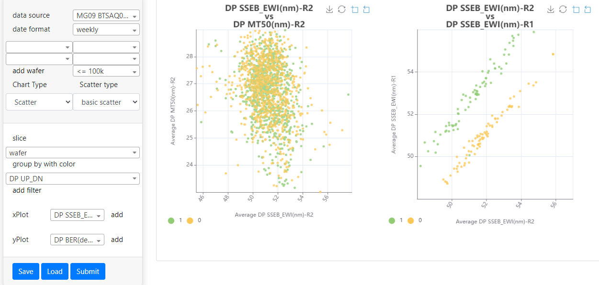
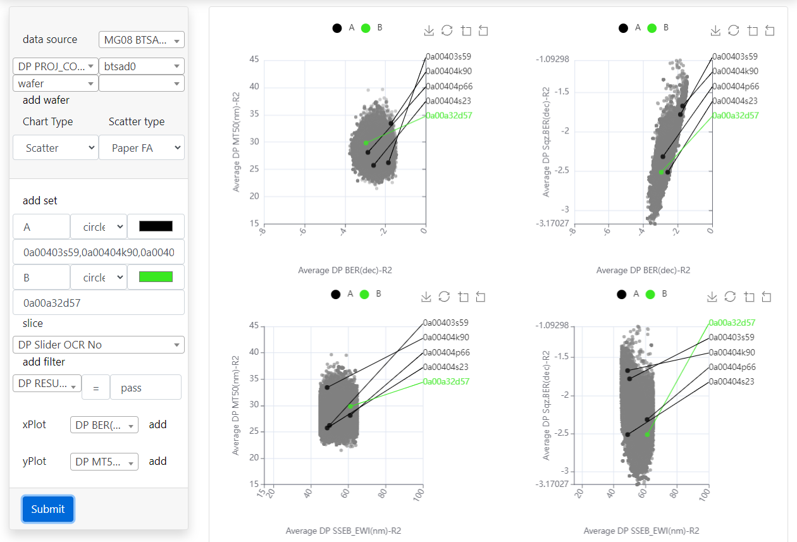
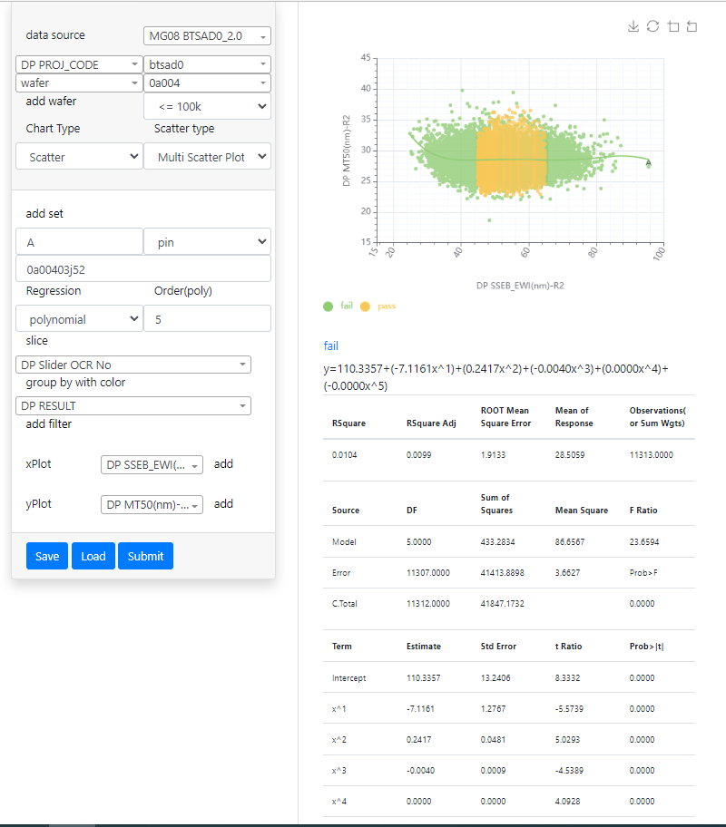
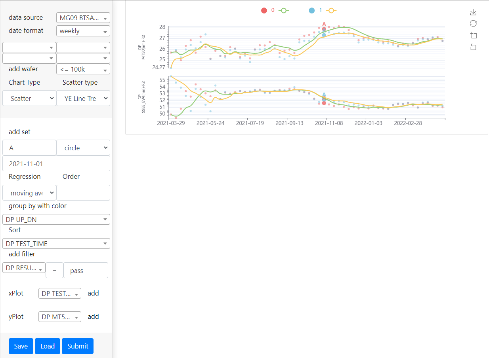
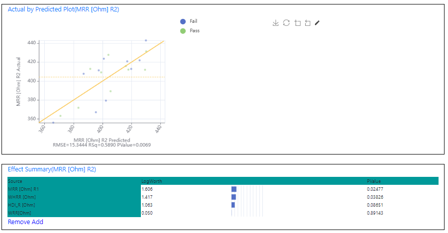
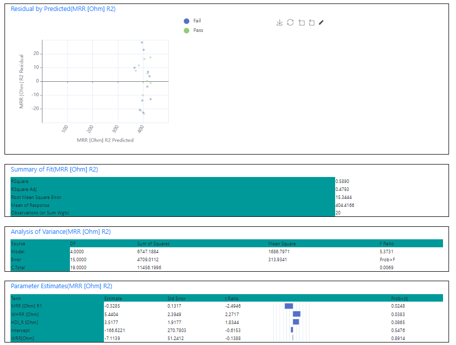
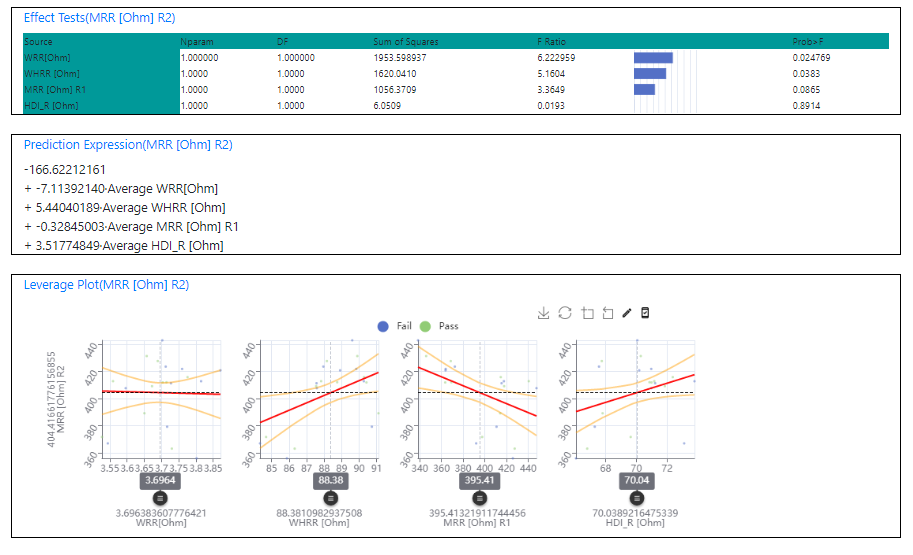
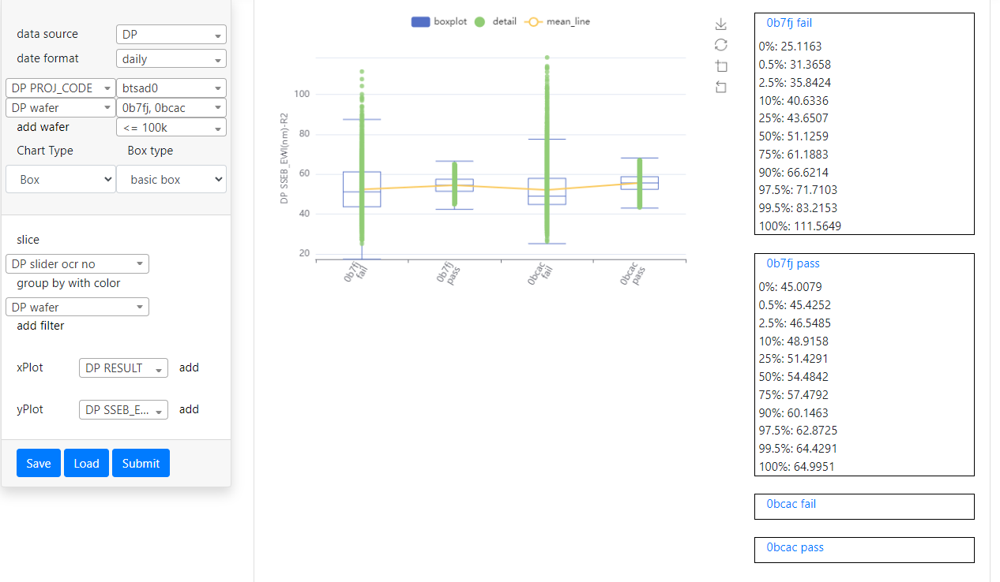
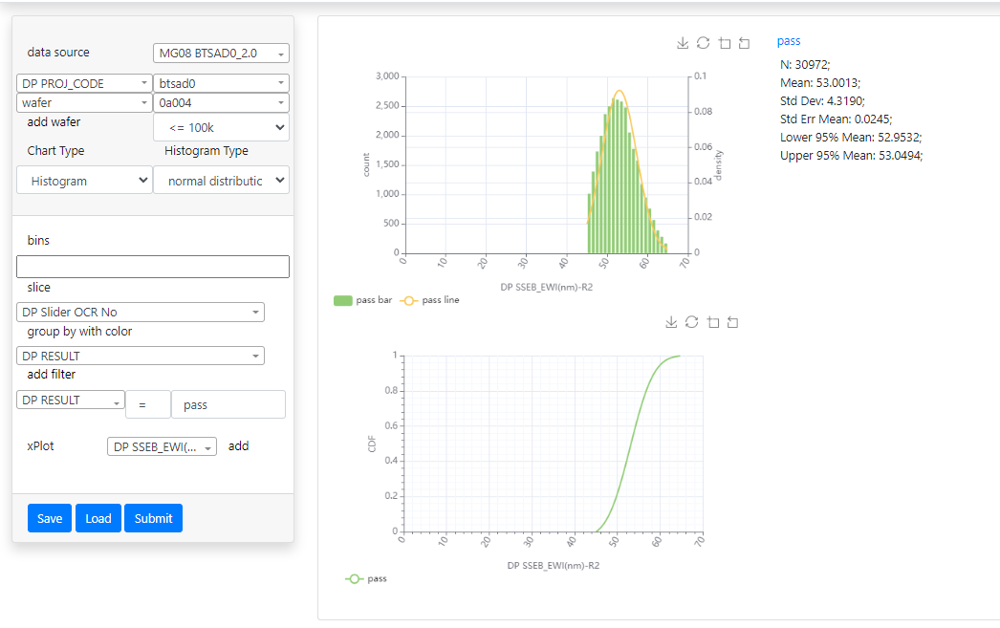
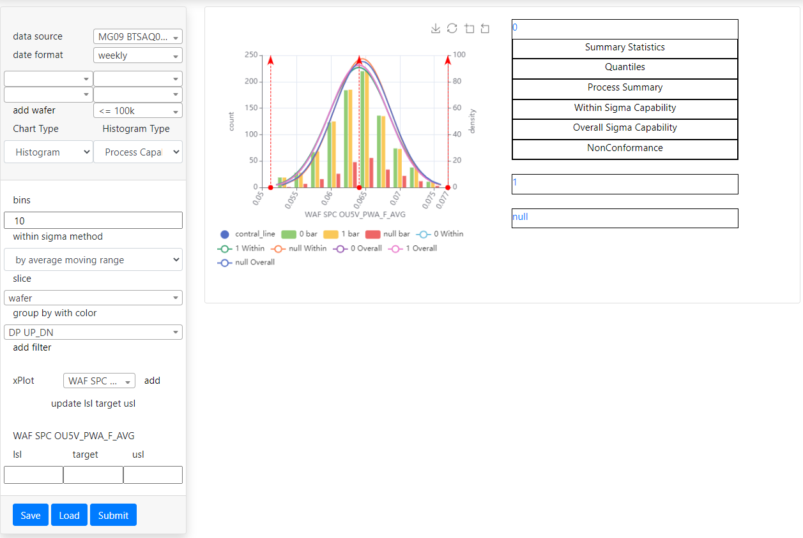

# ReJMP

## Scatter chart
### Basic scatter

### Paper FA

### Multiple scatter plot

### Multiple y axis

### Fit model

## Box chart

## Histogram
### Normal distribution

### Process capability

## line

